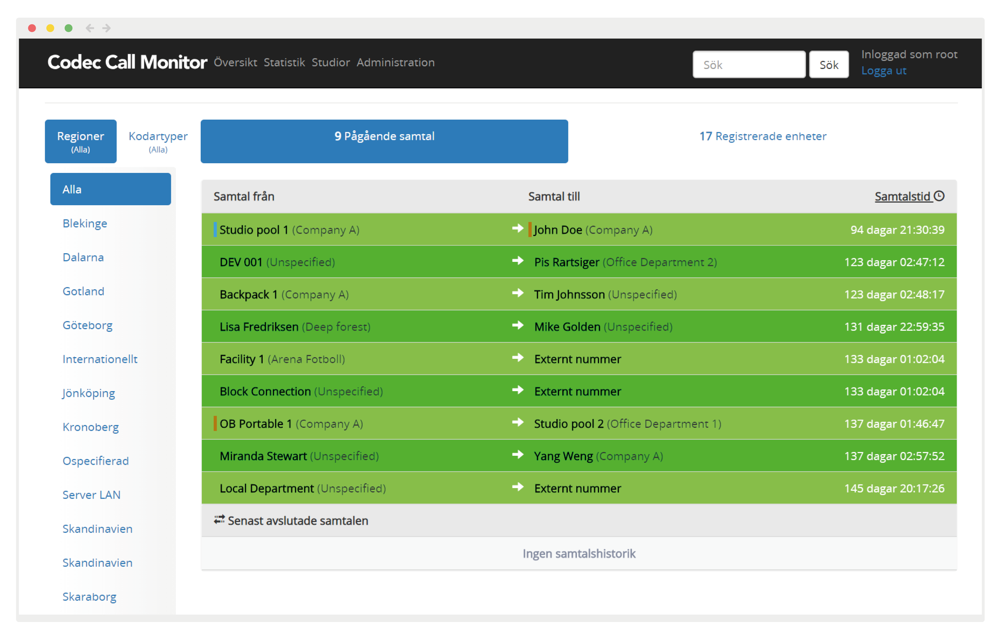

Home - [About ACIP](README_ABOUT.md) - [Contributers](README_CONTRIBUTERS.md)

# Welcome
IRIS Broadcast is a project founded in Sweden to publish Open Source software for professional radio broadcast. The IRIS Codec Call Monitor (CCM) is available for download on GitHub.com.

CCM contains both a live overview of the current broadcasts in our SIP-based contribution network as well as a management platform and a discovery service frequently described as the “Active Phonebook”. The platform is used 24/7 producing over 2500 hours of live radio every month.

The journey from our launch in May 2017 to the initial release of the software November 1st 2017 has been be covered on this website as well as on Twitter (@irisbroadcast). Now the journey continues – forming an open project, creating a dialog with our users and interacting to produce better software.

Our solutions are based on the EBU and IETF standards and are built for national public radio to manage our external contribution platform.

The CCM software is the heart of the IP based contribution network, giving users an overview of the live calls. It also provides a dynamic directory service to all codecs.

The CCM code is now available on [Github.com/irisbroadcast](http://github.com/irisbroadcast) for download, testing and improvements. We invite you to test it and give us feedback!

# THE SOFTWARE - IRIS

The IRIS Broadcast Platform is a management software for live broadcast using ACIP-compatible codec equipment in a professional radio environment.  A versatile and extensible solution based on many years of experience and thousands of hours of live radio produced.

It's a software suite:

#### IRIS Codec Call Monitor + Discovery (.NET MVC + MySQL /MSSQL) (Windows Server)
- Kamailio event reciever
- Discovery REST API ([Description](https://github.com/IrisBroadcast/CCM/tree/master/CCM.DiscoveryApi))
- General Query REST API + Web Socket (SignalR)
- Administrative Interface + Monitor + Statistics

[Github.com/irisbroadcast/CCM](https://github.com/IrisBroadcast/CCM)

#### IRIS Connect (Kamailio + MySQL + RTPengine media server 'Open Source') (Debian Linux)
- Kamailio configuration for sending events to CCM

[Github.com/irisbroadcast/Connect](https://github.com/IrisBroadcast/Connect)

#### IRIS Codec Control (.NET CORE MVC) (Windows/Linux) *Add this if you need codec control*
- Proxy for Codec Control requests, protocol translation and unification
- Query's CCM with SIP-address for getting IP-address to control
- REST API + Web Socket (SignalR) interface for codec control

[Github.com/irisbroadcast/CodecControl](https://github.com/IrisBroadcast/CodecControl)

#### IRIS Dialer (Release May 2019)
- A dialer implementation with the Active Phonebook (IRIS Discovery) and Codec Control API. 

## Platform-independent user friendly interface

Built with the user in focus, IRIS Broadcast delivers a lot of flexibility in a graphical user interface built to support a professional broadcast production. Delivered as a web-based application, the monitor can be used on many devices – from mobile units to wall displays updated in real time.

# Details

## Modular design

The platform consists of several modules that together support the contribution network. IRIS Codec Call Monitor and IRIS Discovery are the management platforms. IRIS Connect is the companion SIP server configuration for the Kamailio Open Source SIP server.

## Features

- Realtime monitoring of all active sessions, including details about the sessions
- Check availability of all connected devices
- Optimize call setup based on network properties, equipment capability
- Integration with many different codecs
- SIP server configuration optimised for live radio contribution

## Benefits

- Best possible audio used in every session
- Gives the master control room an overview of current sessions
- Get statistics over usage per codec type, region or user
- Helps users find available codecs
- Standardised SIP server platform supporting all standard SIP user agents.
- Ready-to-run configuration
- Scalable to thousands of devices and calls

## Technical features

- SIP registrar and proxy supporting standard SIP codecs
- Open Source software and configuration
- Failover between datacenters
- Realtime replication between servers
- Integration with IRIS CCM and discovery using HTTPS
- Support for SIP using UDP, TCP and TLS
- Support for IPv6 and IPv4

# Availability - Free to use, modify and put in production

The IRIS Platform is licensed using an Open Source license (BSD 3-Clause License). Libraries used in the code might contain different licenses. The license will mean that IRIS Broadcast can be freely used in your production, also giving you the rights to modify the software as you wish. We want to build a strong community surrounding the platform and invite you to participate!

## Going forward

There is some general design goals we try to maintain. 
- Think modules and services doing one thing very well instead of a lot of things poorly. Simplicity and easy to maintain.
- Enable scaling, both in terms of redundance and in load balancing.
- We operate in an environment of trust, so authentication and encryption should be put in place everywhere we can. But also keeping in mind that, it needs to be simple to be used.
- People with different levels of programing knowledge contribute and use the system, don't make it difficult to read, maintain and understand the code. Comment freely.

## Goals (2019-May)

- One of the next steps is converting the CCM Project in to .NET Core. So that it could fully be runned in a Linux environment.

- Improving CCMs speed. Entity framework is great, but it can make simple things difficult. And it's easy to make mistakes. We need to do an overhaul of the database queryes and models used for certain things.

- Improving documentation and posting example installations.

## How to

Post questions, bugs and feature requests in the issue tracker for the corresponding project. We are a passionate team that would like to help you get started!

Best regards
Roger
