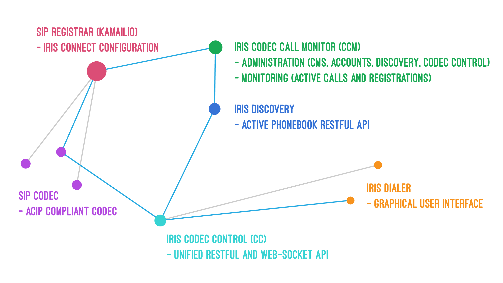

[Home](README.md) - IRIS Platform - [About ACIP](README_ABOUT.md) - [Ophrys Signage](ophrys/README.md) - [Larkspur EmBER+ Provider](larkspur/README_LARKSPUR.md) - [Contributers](README_CONTRIBUTERS.md)

# IRIS Platform: Codec Call Monitor, CodecControl, Connect

Our solutions are based on the EBU and IETF standards and are built for national public radio to manage our external contribution platform.

IRIS Broadcast is a project founded in Sweden to publish Open Source software for professional radio broadcast. The IRIS Codec Call Monitor (CCM) is available for download on GitHub.com.

CCM contains both a live overview of the current broadcasts in our SIP-based contribution network as well as a management platform and a discovery service frequently described as the “Active Phonebook”. The platform is used 24/7 producing over 2500 hours of live radio every month.

The CCM software is the heart of the IP based contribution network, giving users an overview of the live calls. It also provides a dynamic directory service to all codecs.

The CCM code is now available on [Github.com/irisbroadcast](http://github.com/irisbroadcast) for download, testing and improvements. We invite you to test it and give us feedback!

# THE SOFTWARE - IRIS

The IRIS Broadcast Platform is a management software for live broadcast using ACIP-compatible codec equipment in a professional radio environment. A versatile and extensible solution based on many years of experience and thousands of hours of live radio produced.

As a part of replacing the old ISDN contribution. The Audio Contribution over IP (ACIP) enabled us to use regular IP networks with SIP as signaling and RTP as transport. But we needed a system to keep track of all the codecs and our users would strugle to remember IP-addresses and different audio algoritms. How could we provide a phonebook and be sure to provide the right audio compression algoritm selection for each device, location and use-case. The goal was to maintain as high audio quality as possible. And making sure that the call would actually make it across the available network. This is what Codec Call Monitor + Discovery + Connect solves.
Available devices in the SIP-server is accessable as an Active phonebook. By knowing the network segments you use, the phonebook recommends a human readable profile-name representing an Session Description Protocol "SDP".

It's a software suite:

#### IRIS Codec Call Monitor + Discovery (.NET MVC + MySQL /MSSQL) (Windows Server)
- Kamailio event reciever
- Discovery REST API ([Description](https://github.com/IrisBroadcast/CCM/tree/master/CCM.DiscoveryApi))
- General Query REST API + Web Socket (SignalR)
- Administrative Interface + Monitor + Statistics

[Github.com/irisbroadcast/CCM](https://github.com/IrisBroadcast/CCM)

#### IRIS Connect (Kamailio + MySQL + RTPengine media server 'Open Source') (Debian Linux)
- Kamailio configuration for sending events to CCM

[Github.com/irisbroadcast/Connect](https://github.com/IrisBroadcast/Connect)

#### IRIS Codec Control (.NET CORE MVC) (Windows/Linux) *Add this if you need codec control*
- Proxy for Codec Control requests, protocol translation and unification
- Query's CCM with SIP-address for getting IP-address to control
- REST API + Web Socket (SignalR) interface for codec control

[Github.com/irisbroadcast/CodecControl](https://github.com/IrisBroadcast/CodecControl)

## Platform-independent user friendly interface
Built with the user in focus, IRIS Broadcast delivers a lot of flexibility in a graphical user interface built to support a professional broadcast production. Delivered as a web-based application, the monitor can be used on many devices – from mobile units to wall displays updated in real time.

# Details

## Modular design
The platform consists of several modules that together support the contribution network. IRIS Codec Call Monitor and IRIS Discovery are the management platforms. IRIS Connect is the companion SIP server configuration for the Kamailio Open Source SIP server.

## Features
- Realtime monitoring of all active sessions, including details about the sessions
- Check availability of all connected devices
- Optimize call setup based on network properties, equipment capability
- Integration with many different codecs
- SIP server configuration optimised for live radio contribution

## Benefits
- Best possible audio used in every session
- Gives the master control room an overview of current sessions
- Get statistics over usage per codec type, region or user
- Helps users find available codecs
- Standardised SIP server platform supporting all standard SIP user agents.
- Ready-to-run configuration
- Scalable to thousands of devices and calls

## Technical features
- SIP registrar and proxy supporting standard SIP codecs
- Open Source software and configuration
- Failover between datacenters
- Realtime replication between servers
- Integration with IRIS CCM and discovery using HTTPS
- Support for SIP using UDP, TCP and TLS
- Support for IPv6 and IPv4

# ACIP – AUDIO CONTRIBUTION OVER IP
ACIP is an EBU recommentation that is the basis of the IRIS Codec Call Monitor, 
ACIP outlines a few protocols and adds more specific profiles to be used in audio broadcast. 
ACIP is based on a range of IETF protocols for realtime communications – SIP, RTP, SDP and more. 
These protocols are very generic and there are several industry forums that have produced more specific reference profiles, 
like the SIPconnect specification for SIP trunking, created by the SIP Forum.

ACIP was created by a working group in the European Broadcast Union. From the introduction:

> “This document is intended to support EBU-members in the technology of audio over IP systems in audio contribution. It covers basic IP computer and network technologies and proposes suitable protocols for streaming audio over IP. Terminals for audio over IP are now common in radio operations for streaming radio programmes over IP networks. The units are used to create contribution circuits from remote sites or local offices into main studio centres. The IP networks used are usually well-managed corporate networks with good Quality of Service (QoS) and usually high bandwidth. Due to its availability, the Internet is also increasingly used for various cases of radio contribution, especially over longer distances. However, the use of high bit rates and reliable contribution transmissions over the Internet cannot be guaranteed. Correspondents have the choice in their equipment to use either ISDN or the Internet to deliver their reports. More than 20 manufacturers provide equipment for audio over IP applications.” 

The working group has concluded it’s work and  there are three documents published:

- [EBU tech 3326 – Audio Contribution over IP – Requirements for Interoperability](https://tech.ebu.ch/publications/tech3326)
- [EBU tech 3368 – Audio Contribution over IP – Profiles](https://tech.ebu.ch/publications/tech3368)
- [EBU tech 3329 – A Tutorial on Audio Contribution over IP](https://tech.ebu.ch/publications/tech3329)
