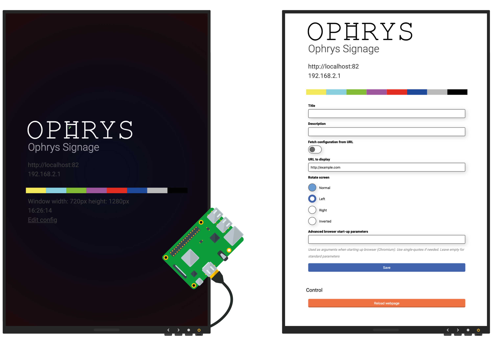

[Home IRIS](../README.md) - [About ACIP](../README_ABOUT.md) - Ophrys Signage - [Contributers](../README_CONTRIBUTERS.md)

# Ophrys Signage

* Web Site: https://www.irisbroadcast.org/ophrys
* Github: [Github.com/irisbroadcast/OphrysSignage](https://github.com/IrisBroadcast/OphrysSignage)

A simple way to display a webpage on a screen without all the fuzz.
Basic signage solution with configuration page for url selection,
screen rotation and option to fetch configuration settings from
external server. We are using it with Debian Buster on
Raspberry Pi 3 and 4. This should work fine on other hardwares
as well. Let us know if you run in to any problems or have any questions.

Components
- Whiptail install script (Guides the installation of dependencies)
- Debian + OpenBox + LightDm + Feh
- Chromium Browser + OMXPlayer
- NodeJs server for configuration
- Bash scripts for setting URLs and screen rotation

Features
- Fullscreen browser without window decorations
- Boot image on system start (Ophrys graphics)
- Rotate screen on both Raspberry Pi 3 and 4 without reboot
- Load a configuration JSON from an external site with settings
- REST API for page refresh and */health* endpoint for status information

## Download Ophrys installer
Get the installer here [Download Ophrys installer ](http://irisbroadcast.com/ophrys/install.tar.gz)